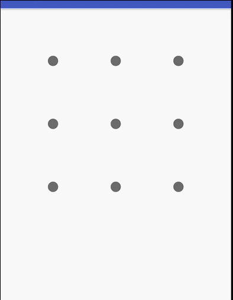

# LockScreenView
自定义锁屏View  
  
## 说明：
1.可以配置每行的图案数  
2.可以配置图案默认状态、正确和错误时的颜色  
3.可以配置图案中大圆圈和小圆圈的半径  
  
## 效果图：  
  
  
## 使用示例  
### 使用前需要设置锁屏的正确答案：  
```
LockScreenViewGroup lockScreenViewGroup = (LockScreenViewGroup) findViewById(R.id.lockScreenViewGroup);
int[] answers = {1,2,3,5,7,8,9};
lockScreenViewGroup.setAnswers(answers);
```  
### 布局文件中代码：(app相关的属性也可以不设置，不设置的话会使用默认值)   
```
 <com.example.lenovo.lockscreenview.LockScreenViewGroup
       android:id="@+id/lockScreenViewGroup"
       android:layout_width="match_parent"
       android:layout_height="match_parent"
       app:normalColor="#666666"
       app:smallRadius="8dp"
       app:bigRadius="16dp"
       app:rightColor="#33FF66"
       app:wrongColor="#FF3333"/>
```  
  
## 博客地址：[自定义锁屏控件](http://www.jianshu.com/p/ebf23197820c)   
